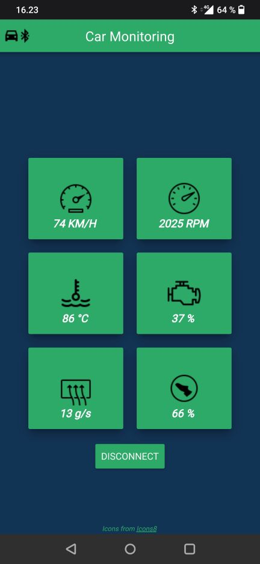
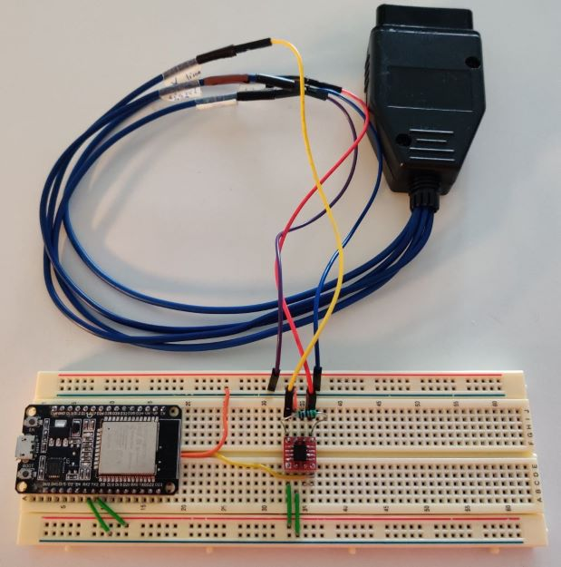
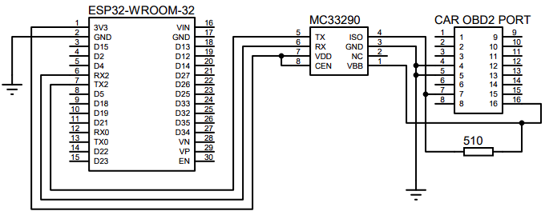

# Car-Monitoring-App

## About
An android application that can be used to display data read from a vehicle OBD port.
ESP32 microcontroller module is used to interface with the vehicle OBD port and send
data to smartphone via bluetooth.

## Application

Application receives six different diagnostic values from the car:
speed, engine speed, coolant temperature, engine load, mass air flow, and
throttle pedal position.

See [app](https://github.com/Jori-Rintakangas/Car-Monitoring-App/tree/master/app)
for more details.

## Hardware

The hardware is operational with cars that use ISO 9141 (K-line) protocol for
signaling the data. MC33290 K-line transceiver is used to communicate
between ESP32 and the vehicle K-line.

See [obd](https://github.com/Jori-Rintakangas/Car-Monitoring-App/tree/master/obd)
for more details.

## Schematic

